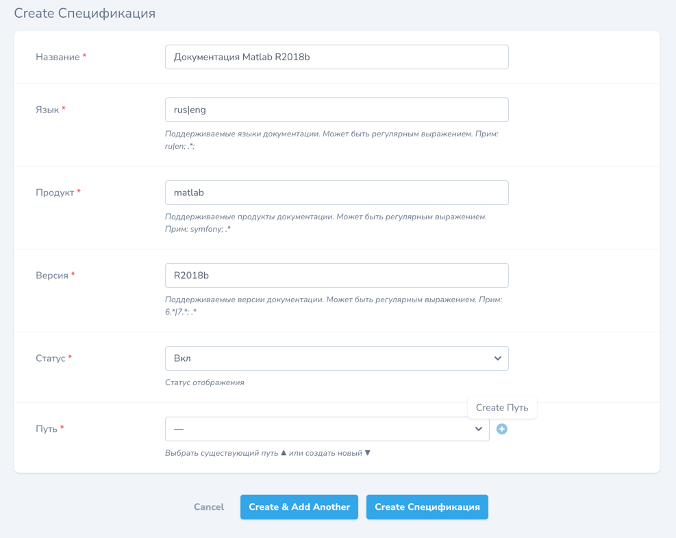

# Начало работы

## Создание спецификации

### [Спецификация](aspect.md)

### Путь

Путь в файловой системе.

Драйвер:

- **local** - поиск в локальной ФС
- **remote** - поиск в удаленной системе
- **eloquent** - поиск в БД

Для просмотра распакованного архива необходимо выбирать local драйвер.

Маппинг путей:

- **app-config.release_folder**/{version}/{version}_{lang}/{product}/{page}
- **/var/www/storage/app/release**/R2019a/R2019a_rus/matlab/index.html

Стандартный для **eloquent** маппинг - **/{lang}/{product}/{version}/{page}**

### Результат

Можно загружать архив.

### Настройка аспекта

### Декораторы

## Загрузка архива

Стратегии распаковки:

- **dummy** - пустышка
- **zip** - распаковка средствами PHP [ZipArchive](https://www.php.net/manual/ru/class.ziparchive.php)
- **zip_manual** - нативная* распаковка командой [unzip](https://metanit.com/os/linux/4.3.php)
- **tar_manual** - нативная* распаковка командой tar
- **gzip_manual** - нативная* распаковка командой gunzip

`*` - средствами linux

## Чтение из БД

В текущем варианте, существует автоматическая обработка контента статьи [readability.js](https://github.com/mozilla/readability)
и сохранение его в БД [ProductSaverReceiverHandler.php](..%2F..%2F..%2F..%2F..%2F..%2Fapp%2FDocumentation%2FAspectPlugin%2FProduct%2FProductSaverReceiverHandler.php).

Т.е. после распаковки архива происходит чтение распакованных данных и запись в БД.

Так вот что бы начать использовать эти данные, нужно создать дополнительный аспект который будет иметь eloquent driver.
Будем считать что аспект, который был создан первоначально, будет загрузочным аспектом, и далее в нем нет нужды.

Нужно обратить внимание, что если оба аспекта будут существовать и иметь одни данные, будет работать тот, который выше по списку.
