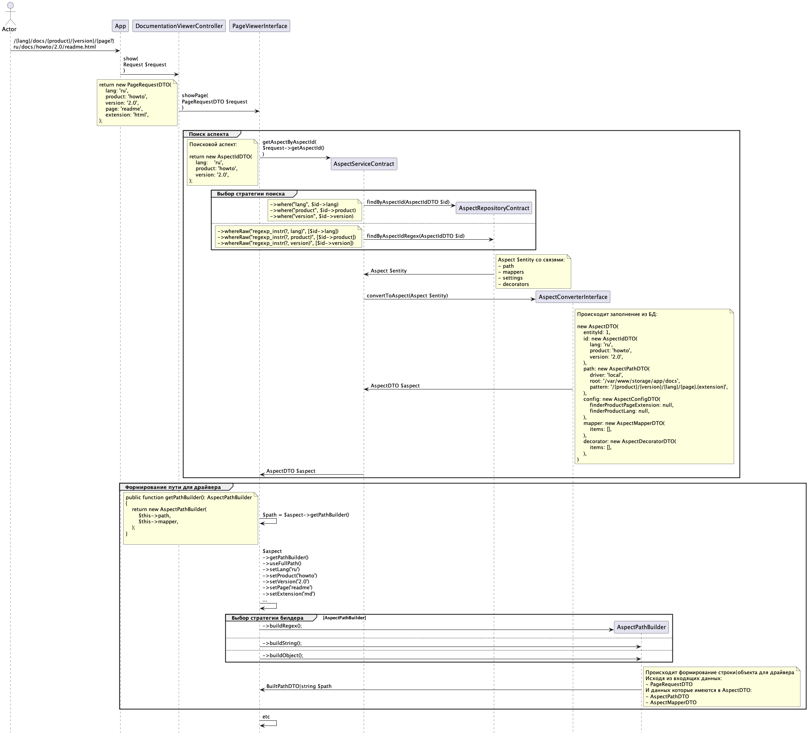

# Module: Documentation.Aspect
# Спецификация (Аспект)



## Вводные

Аспект ключевой модуль преобразования урла в конечный путь.

Мы имеем `uri`:

```php
Route::get('/{lang}/docs/{product}/{version}/{page?}', [PagesController::class, 'show'])
```

Имеем аспект (все параметры могут быть регулярными выражениями; сохранен в БД):

```php
new AspectIdDTO(
    lang: 'rus|eng',
    product: 'matlab',
    version: 'R2018b'
)
```

Имеем путь (сохранен в БД):

```php
new AspectPathDTO(
    driver: 'local',
    root: '/var/www/storage/app/release',
    pattern: '/{version}/{version}_{lang}/{product}/{page}',
)
```

## Поисковой аспект

После перехода по ссылке `uri`, например, `http://localhost/rus/docs/matlab/R2018b/index.html` происходит следующее:

Формирование запроса для сервиса:

```php
new PageRequestDTO(
    lang: 'rus',
    product: 'matlab',
    version: 'R2018b',
    page: 'index',
    extension: 'html',
)
```

Далее, `PageRequestDTO` формирует поисковой аспект:

```php
new AspectIdDTO(
    lang: 'rus',
    product: 'matlab',
    version: 'R2018b'
)
```

По этому, в ручную сформированному аспекту, ищется подходящий аспект в БД по регулярному выражению ([AspectService.php](..%2F..%2F..%2F..%2F..%2F..%2Fapp%2FAspect%2FServices%2FAspectService.php)):

```php
public function findByAspectId(AspectIdDTO $id): ?Aspect
{
    $builder = $this
        ->getBuilder()
        ->whereRaw("regexp_instr(?, lang)", [$id->lang])
        ->whereRaw("regexp_instr(?, product)", [$id->product])
        ->whereRaw("regexp_instr(?, version)", [$id->version])
    ;
    
    return $this
        ->getBase($builder)
        ->first();
}
```

Т.е. мы ищем оригинальный аспект (созданный в БД и заполненный регулярками), аспектом конкретным. 
В целом тут мог быть любой другой объект, или массив данных.

В процессе нахождения оригинального аспекта, к нему подгружаются все связи:

```php
private function getBase(Builder $builder): Builder
{
    return $builder
        ->where('status', StatusEnum::Enabled)
        ->whereHas('path')
        ->with([
            'path',
            'mappers' => function (HasMany $builder) {
                $builder
                    ->where('status', StatusEnum::Enabled);
            },
            'decorators' => function (HasMany $builder) {
                $builder
                    ->where('status', StatusEnum::Enabled)
                    ->orderBy('sort_order');
            },
        ])
        ->orderBy('sort_order')
    ;
}
```

И на выходе мы имеем заполненный AspectDTO ([AspectConverter.php](..%2F..%2F..%2F..%2F..%2F..%2Fapp%2FAspect%2FConverters%2FAspectConverter.php)):

```php
return new AspectDTO(
    id: new AspectIdDTO(
        lang: 'rus|eng',
        product: 'matlab',
        version: 'R2018b',
    ),
    path: new AspectPathDTO(
        driver: 'local',
        root: '/var/www/storage/app/release/',
        pattern: '/{version}/{version}_{lang}/{product}/{page}',
    ),
    mapper: new AspectMapperDTO(
        items: [],
    ),
    decorator: new AspectDecoratorDTO(
        items: [],
    ),
);
```

где, все данные записаны из БД.

## Работа с AspectDTO

Далее, из AspectDTO вытаскиваются:

- путь
- мапперы
- драйвер
- декораторы

### Путь

Из `PageRequestDTO` и `AspectPathDTO` мы должны как-то получить конечный файл, 
который и нужно открыть. В дело вступает [AspectPathBuilder.php](..%2F..%2F..%2F..%2F..%2F..%2Fapp%2FAspect%2FBuilders%2FAspectPathBuilder.php).

`AspectPathBuilder` может вернуть:

- заполненный путь - `/R2018b/R2018b_rus/matlab/index.html`
- заполненный полный путь - `/var/www/storage/app/release/R2018b/R2018b_rus/matlab/index.html`
- регулярное выражение пути - `~/?(?P<version>\w+)/(?P=version)_(?P<lang>\w+)/(?P<product>\w+)/?(?P<page>.*\.\w+)?$~`
- заполненное или частично заполненное регулярное выражение - `~/?(?P<version>R2018b)/(?P=version)_(?P<lang>rus)/(?P<product>\w+)/?(?P<page>.*\.\w+)?$~`
- объект `BuiltPathDTO` (надо еще с ним поработать)

#### Мапперы

В `AspectPathBuilder` передается не только путь, но и мапперы.

Допустим, мы имеем 

```
uri pattern: /{lang}/docs/{product}/{version}/{page?}
uri: http://localhost/rus/docs/matlab/R2018b/index.html
pattern: /{version}/{version}_{lang}/{product}/{page}
Конечная страница: /R2018b/R2018b_rus/matlab/index.html в файловой системе
```

И хотим что бы язык был не `rus|eng`, а `ru|en`, вот тут вступают мапперы. С оговоркой. Для этого нужно что-бы был соответствующий аспект.

```php
new AspectIdDTO(
    lang: 'ru|en', // <- 'rus|eng'
    product: 'matlab',
    version: 'R2018b'
)
```

К нему маппер:

```php
new AspectMapperItemDTO(
    pattern: '{lang}',
    from: 'ru',
    to: 'rus',
)
```

Теперь при переходе по ссылке `http://localhost/ru/docs/matlab/R2018b/index.html` сработает маппер и конечный путь для драйвера изменится с
`/R2018b/R2018b_ru/matlab/index.html` на `/R2018b/R2018b_rus/matlab/index.html` и откроется страница. А вот если мы перейдем по ссылке
`http://localhost/en/docs/matlab/R2018b/index.html` то изменений в пути не произойдет, тк маппер создан только на ru язык и драйвер попытается открыть `/R2018b/R2018b_en/matlab/index.html` - 
которого не существует, тк он лежит в `/R2018b/R2018b_eng/matlab/index.html`

Работа с маппера с параметрами аспекта всегда требует соответствующий аспект.

Если мы хотим изменить страницу, то в этом случае менять аспект не нужно.

```php
new AspectIdDTO(
    lang: 'rus|eng', // <- orig
    product: 'matlab',
    version: 'R2018b'
)
```

```php
new AspectMapperItemDTO(
    pattern: '{page}',
    from: '/',
    to: 'index.html',
)
```

В этом случае мы делам возможным переход по корневому урлу `http://localhost/rus/docs/matlab/R2018b/` 
и с помощью маппера у нас путь для драйвера будет `/R2018b/R2018b_rus/matlab/index.html`

Мапперы работают с паттерном пути и могут изменять только зарезервированные паттерны:

- `{lang}`
- `{product}`
- `{version}`
- `{page}`
- `{extension}`

Собственно как и `AspectPathBuilder` может изменять только их.

Те если будет паттерн `{foo}` - то в пути он так и останется как `{foo}`.

#### Nginx

Nginx настроен что-бы отдавать статичные файлы минуя php.

Те для пути

```php
new AspectPathDTO(
    driver: 'local',
    root: '/var/www/storage/app/release',
    pattern: '/{version}/{version}_{lang}/{product}/{page}',
)
```

Nginx имеет конфиг:

```nginx
location ~/(ru|rus|en|eng)/docs/(matlab)/(R2018b)/(.*\.(png|ico|gif|jpg|jpeg|css|js|woff|ttf|svg))$ {
    set $lang    $1;
    set $product $2;
    set $version $3;
    set $page    $4;

    if ( $lang = "ru" ) {
        set $lang "rus";
    }

    if ( $lang = "en" ) {
        set $lang "eng";
    }

    if ( $page ~* "(.*)%2B(.*)" ) {
        set $page "$1+$2";
    }

    alias /var/www/storage/app/release/$version/${version}_$lang/$page;
}
```

(пример с несколькими языками, для маппера)


### Драйвер

После того как `AspectPathBuilder` сделал свою работу, происходит работа с драйвером:

- `LocalDriver` - поиск в файловой системе
- `RemoteDriver` - поиск в удаленной системе
- `EloquentDriver` - поиск в БД

Драйвер реализует интерфейс [Driver.php](..%2F..%2F..%2F..%2F..%2F..%2Fapp%2FPage%2FDriver%2FContracts%2FDriver.php):

```php
interface Driver
{
    /**
    * @param DriverRequestDTO $request
    * @return DriverResponseDTO
    * @throws DriverException
    */
    public function showPage(DriverRequestDTO $request): DriverResponseDTO;
}
```

Из полученных от `AspectPathBuilder` данных формируется `DriverRequestDTO` и передается конкретному драйверу,
который ищется в списке зарегистрированных в контейнере драйверов (этот список так же выводится на первом шаге создания пути)
по `AspectDTO->path->driver`.

Конкретный драйвер идет в конкретное место по пути и выдает найденный контент.

Пример краткой реализации `LocalDriver`:

```php
public function showPage(DriverRequestDTO $request): DriverResponseDTO
{
    $path = Str::replace('//', '/', $request->getRootWithPath());

    try {
        $file = new SplFileObject($path);
    } 

...

    return new DriverResponseDTO(
        content: $file->fread($file->getSize()),
    );
}
```

где, `$request->getRootWithPath()` возвращает `/var/www/storage/app/release/R2018b/R2018b_rus/matlab/index.html` (или другую страницу)

### Декораторы

Зачем оно вообще надо?

Один из базовых декораторов [IncludesDecorator.php](..%2F..%2F..%2F..%2F..%2F..%2Fapp%2FPage%2FDecorator%2FDecorators%2FIncludesDecorator.php) меняет пути инклюдов в html на наши новые пути.

Был путь `../includes/product/css/site6.css?201808230547` стал путь `/rus/docs/matlab/R2018b/includes/product/css/site6.css?201808230547` и все css и js файлы корректно подключаются.

Ну итд. Для изменения контента.

Декоратор наследует [BaseDecorator.php](..%2F..%2F..%2F..%2F..%2F..%2Fapp%2FPage%2FDecorator%2FContracts%2FBaseDecorator.php) и реализует [StringPipe.php](..%2F..%2F..%2F..%2F..%2F..%2Fapp%2FCore%2FContracts%2FStringPipe.php):

```php
interface StringPipe
{
    public function handle(string $content, \Closure $next): mixed;
}
```

К аспекту прикрепляется только название декоратора, по которому ищется уже готовый объект декоратора в контейнере (аналогично драйверам).

```php
return new AspectDTO(
    ...
    decorator: new AspectDecoratorDTO(
        items: [
            new AspectDecoratorItemDTO(
                name: 'IncludesDecorator',
            )
        ],
    ),
    ...
);
```

После получения контента от драйвера, он пропускается через цепочку декораторов прикрепленных к аспекту ([ContentDecorationService.php](..%2F..%2F..%2F..%2F..%2F..%2Fapp%2FPage%2FDecorator%2FServices%2FContentDecorationService.php)).

### Результат

Результатом является объект [PageResponseDTO.php](..%2F..%2F..%2F..%2F..%2F..%2Fapp%2FPage%2FViewer%2FDTO%2FPage%2FPageResponseDTO.php), который отдается в браузер:

```php
new PageResponseDTO(
    status: 200,
    content: '... decorated html ...',
    contentType: 'text/html',
);
```

## Загрузка|Распаковка

Загрузка происходит в [FieldsController.php](..%2F..%2F..%2F..%2F..%2F..%2Fnova-components%2FArchive%2FUploader%2Fsrc%2FHttp%2FControllers%2FFieldsController.php)

Контроллер перемещает архив в постоянное хранилище и создает задачу на распаковку. 

```php
final class ArchiveUploaderJobManager implements ArchiveUploaderJobManagerInterface
{
    public function createJob(
        int $aspectId,
        string $archiveHash,
        string $unpackerStrategy,
        string $archivePath,
    ): void {
        $job = new ArchiveUploaderJob(
            $aspectId,
            $archiveHash,
            $unpackerStrategy,
            $archivePath,
            Uuid::uuid4()->toString(),
        );
        
        ...
    }
}
```

- [ArchiveUploaderJobManager.php](..%2F..%2F..%2F..%2F..%2F..%2Fnova-components%2FArchive%2FUploader%2Fsrc%2FManagers%2FArchiveUploaderJobManager.php)
- [ArchiveUploaderJob.php](..%2F..%2F..%2F..%2F..%2F..%2Fnova-components%2FArchive%2FUploader%2Fsrc%2FJobs%2FArchiveUploaderJob.php)

`ArchiveUploaderJobManager` занимается:

- Валидацией архива
- Получения корневой папки в архиве
- Получение продуктов в архиве
- Распаковка архива
- Отправляет событие [ProductUploaded.php](..%2F..%2F..%2F..%2F..%2F..%2Fnova-components%2FArchive%2FUploader%2Fsrc%2FEvents%2FProductUploaded.php)

```php
class ProductUploaded
{
    public function __construct(
        public int $aspectId,
        public string $jobUuid,
        public string $productPath,
    ) {
    }
}
```

- Удаляет перемещенный архив

В: Зачем нужен `$aspectId`?

О: Для получения пути заполненного регуляркой

В разделе [Путь](#путь) было описано, что может вернуть `AspectPathBuilder`:

- заполненное или частично заполненное регулярное выражение - ~/?(?P<version>R2018b)/(?P=version)_(?P<lang>rus|eng)/(?P<product>matlab)/?(?P<page>.*\.\w+)?$~

Оно заполняется с помощью аспекта из БД.

С помощью этой регулярки можно оперировать данными архива или же уже распакованными данными без хождения по урл - те без точных данных.

Далее отправляется событие `ProductUploaded` слушатели которого уже могут проводить манипуляции с распакованными данными.

- Индексация в ES
- Генерация и сохранение меню
- Вырезка только тела страницы и сохранение в БД
- ... итд

Стоит только добавить слушателя и расширить функционал ([ListenerManager.php](..%2F..%2F..%2F..%2F..%2F..%2Fnova-components%2FArchive%2FUploader%2Fsrc%2FManagers%2FListenerManager.php)).

- Создаем слушателя
- Реализуем `Handler`

```php
interface Handler
{
    public function handle(FileDTO $file): void;
}
```

- Передаем `Handler` из слушателя события в `ListenerManager` и обрабатываем `FileDTO`
- Пример: [OnProductUploadedRunIndexerJob.php](..%2F..%2F..%2F..%2F..%2F..%2Fnova-components%2FArchive%2FUploader%2Fsrc%2FJobs%2FOnProductUploadedRunIndexerJob.php)
