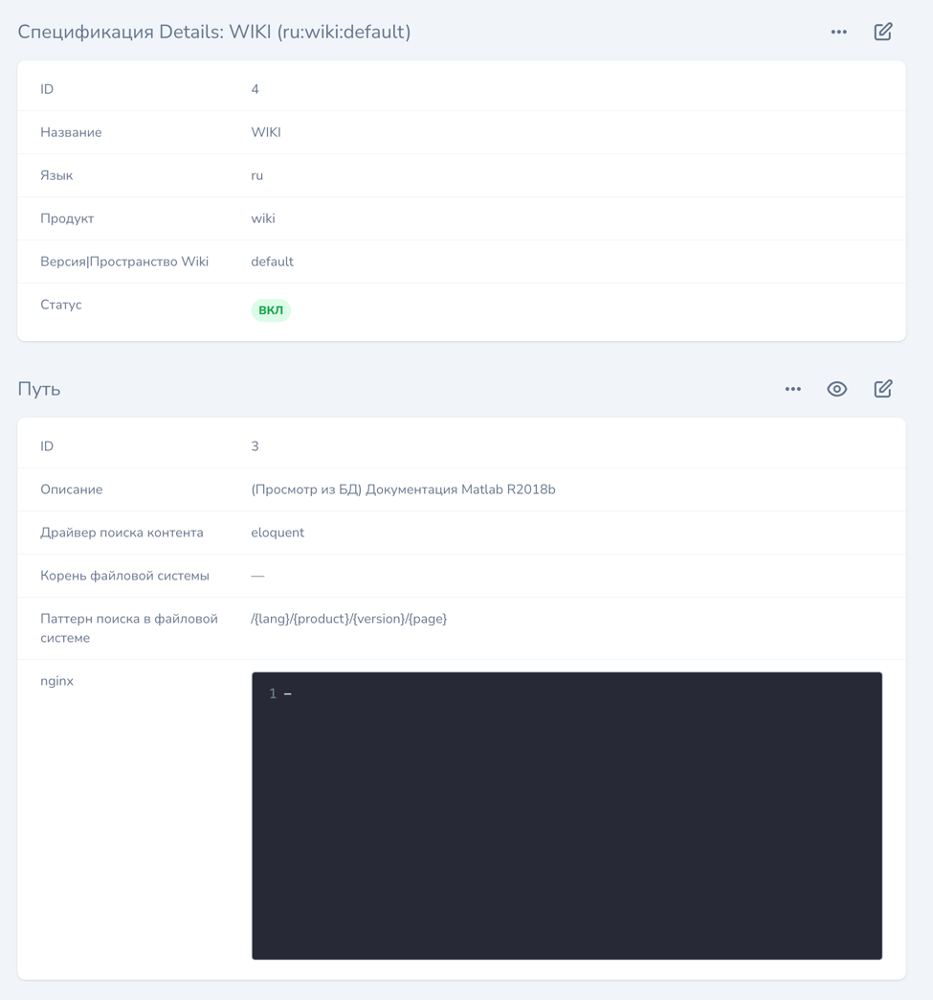

### Module: Documentation.Viewer -> Wiki

Вики система построена на механизме аспектов.

Вики системе необходим специальный аспект:

где,
- **lang** - Язык - поддерживаемый язык `wiki`
- **product** - Продукт - зарезервированное слово `wiki`
- **version** - Версия - или - **space** - пространство wiki системы, зарезервированное слово `default` 
(поддержка других пока отсутствует)
- **path** - Путь - используется любой `eloquent` путь

#### Просмотр

- `/{lang}/wiki/` - главая `wiki` страница

- `/{lang}/wiki/{page}` - конкретная `wiki` страница
